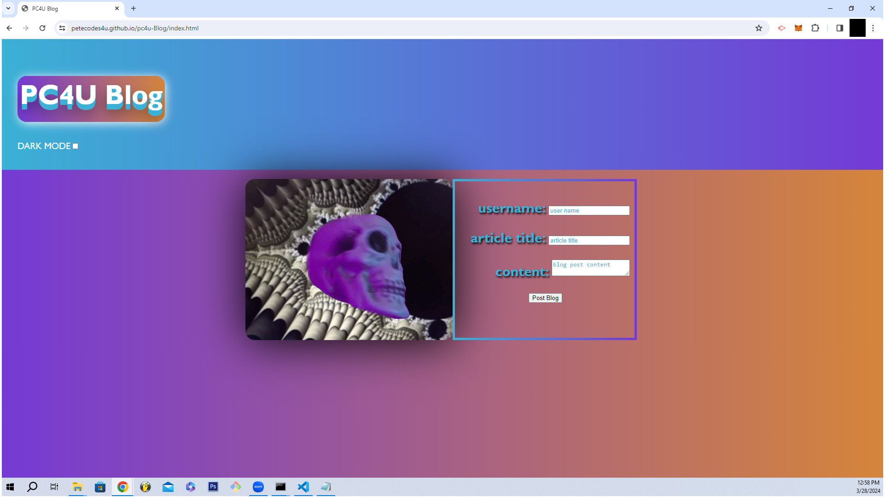

# <PC4U Blog>

## Description

This project has been created to create text posts that can be created by the user on completion and submission of the user form rendered in the entry portal. The project's functionality leverages a users browser localStorage to create JSON objects from the form data entered by the user. This project has been created to demonstrate a blog post solution for publishing ideas and thoughts in text for others to potentially access and review.  The general intention of the solution is to provide an outlet for sharing information that can be used to document the human experience and optimally to provide inspiration to others.     

## Table of Contents

- [Usage](#usage)
- [Credits](#credits)
- [Tests](#Tests)

## Link to Website
https://petecodes4u.github.io/pc4u-Blog/

## Usage

The intended usage of this application is to generate blog posts from the information entered by a user. 

## Features

- User form with labels and inputs for username blog title and blog content.
- User form validation - user is denied redirect to blog page without completing the userform.
- User form data is storred in  the browser localStorage in JSON.
- Dynamic data blog posts page with blog posts.
- light / dark mode toggle.
- Blog post page "back" button. 
- User prompt to collect another employee.

## Tests
 
 **Feature - User form**
 
 **GIVEN :** the webpage loads successfully.
 
 **WHEN :** the app loads.
 
 **THEN :** a landing page containing a form is rendered with labels and inputs for username blog title and blog content.

##

 **Feature - User form**

 **GIVEN :** the webpage loads successfully.  
 
 **WHEN :** the user fills out all information and clicks the Post Blog button.
 
 **THEN :** the form data is storred in local storage. 

##

 **Features - User Form**

 **GIVEN :** The user form is fully completed.
 
 **WHEN :** the user clicks the Post Blog button.
 
 **THEN :** the user is redirected to the blog posts page.

##

 **Feature - User Form**

 **GIVEN :** the user form is NOT fully completed
 
 **WHEN :** the user clicks the Post Blog button.
 
 **THEN :**  the user is recieves a pop up alert propting completion of the form and the user is not redirected to the blog post page.

##

 **Feature - Blog Page**

 **GIVEN :** the BLOG page is loaded successfully.
 
 **WHEN :** the blog post page loads.
 
 **THEN :**   the page renders a light / dark toggle mode and a "back" button in the header.

 ##

 **Feature - Blog Page Light/Dark Mode**

 **GIVEN :** the BLOG page is loaded successfully.
 
 **WHEN :** the user clicks the light/dark mode toggle.
 
 **THEN :** the page renders a dark mode theme.

 ##

 **Feature - Blog Page Back Button**

 **GIVEN :** the BLOG page is loaded successfully.
 
 **WHEN :** the user clicks the back button.
 
 **THEN :** the user is returned to the blog entry form.
 

##

 **Feature - Blog Page**

 **GIVEN :** the BLOG page is loaded successfully.
 
 **WHEN :** the blog page loads.
 
 **THEN :**  blog entry form data storred in local storage is transcribed on the page.

##

 **Feature - Blog Page**

 **GIVEN :** the BLOG page is loaded successfully.
 
 **WHEN :** the user inspects the localStorage in the browser.
 
 **THEN :** a JSON array of blog post objects is avaialble containing the data from the user form.

##

 **Feature - Blog Page**

 **GIVEN :** the BLOG page is loaded successfully.
 
 **WHEN :** the user views a blog post.
 
 **THEN :** the title, content and author of the post is visible.

## Credits

I would like to credit geeksforgeeks for providing a demonstration of how to make a 3D effect with CSS that I used for the PC4U blog title and Dark Mode toggle hover.
https://www.geeksforgeeks.org/create-a-3d-text-effect-using-html-and-css/
